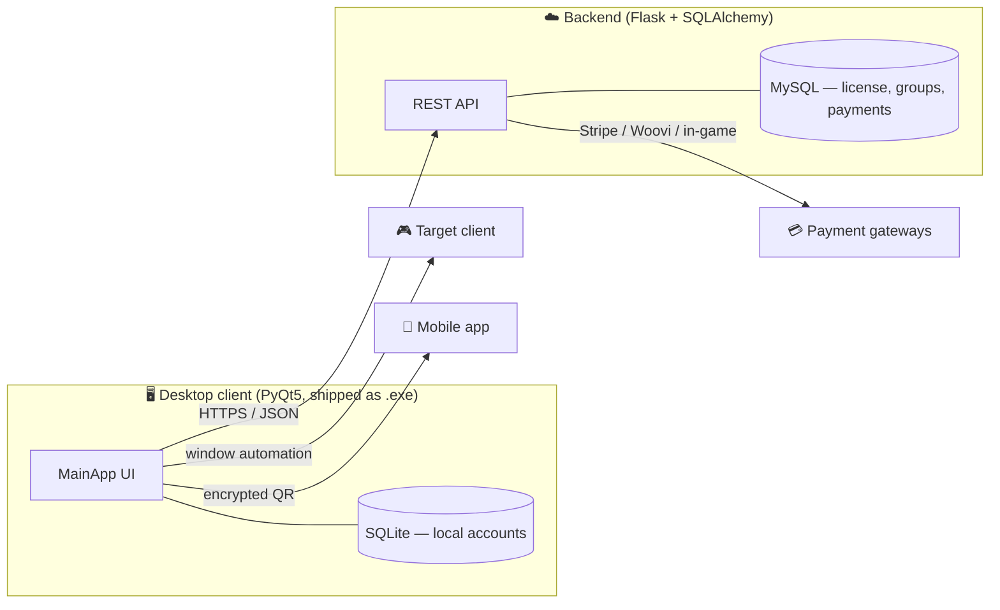

<div align="center">

# 🔐 Patxoken — Account & 2FA Manager

**Full-stack Python product** · Desktop client (PyQt5) + REST API (Flask) · In production


A desktop app that securely stores accounts, generates **TOTP (2FA)** codes, performs **automated login**,
and syncs licensing, groups and notices with a cloud API — with **three integrated payment gateways**
for automatic license renewal.

</div>

> **Note on source code.** This repository is a **public showcase** of a commercial product.
> The full source is private; this README documents the architecture and engineering decisions.
> Code walkthrough available on request.

---

## 📸 Screenshots

| Account list | TOTP / 2FA | Settings |
|---|---|---|
| _(screenshot)_ | _(screenshot)_ | _(screenshot)_ |

---

## ✨ Features

- 🔑 **TOTP / 2FA (RFC 6238)** — generate time-based codes locally; import via QR code.
- 🖥️ **Automated login** — fills credentials into the target client via window automation.
- ☁️ **Cloud sync** — license, shared groups and notices served by a Flask/MySQL API.
- 💳 **Three payment gateways** — Stripe, Woovi/PIX and an in-game currency flow, for automatic license renewal.
- 🧾 **Per-machine licensing** — Windows-registry `SystemID` + hardware fingerprint, validated server-side.
- 📱 **Mobile export** — share accounts to the companion Flutter app through an encrypted QR payload.
- 🌐 **Bilingual UI** (PT/EN) with an automated test that guarantees translation-key parity.
- 🔄 **Self-update** — the client checks the server for new versions and updates itself.
- 🧪 **Anti-crash pipeline** — static + runtime checks run before every `.exe` build.

---

## 🏗️ Architecture

Two halves in one product: a **desktop client** that keeps the user's sensitive data on-device,
and a **cloud API** that owns licensing, payments and shared data.



**Key principle — data separation:** credentials (email, password, TOTP secret) **never leave the device**;
they live in an encrypted local SQLite under `%APPDATA%`. The cloud only holds metadata it actually needs
(license status, group membership, payment records).

---

## 🧰 Tech stack

| Layer | Technology |
|---|---|
| **Desktop** | Python · PyQt5 · qdarkstyle · packaged with PyInstaller (onedir) |
| **Crypto / 2FA** | `cryptography` (Fernet) · `pyotp` (TOTP) · `qrcode` / `pyzbar` |
| **Automation** | `pyautogui` · `pygetwindow` · `pyperclip` |
| **Backend** | Flask · SQLAlchemy · MySQL |
| **Payments** | Stripe · Woovi (PIX) · in-game currency verification |
| **Local storage** | SQLite (`%APPDATA%`) |
| **Quality** | pytest · pyflakes · compileall (pre-build crash sweep) |

---

## 🔒 Security & engineering highlights

These are the decisions I'm most proud of — the parts that make this production-grade rather than a demo:

- **On-device secrets.** Sensitive credentials are stored only in the local SQLite and are never sent to the server.
  The cloud database is intentionally unable to read a user's passwords or TOTP secrets.
- **Hardware-bound licensing.** A `SystemID` persisted in the Windows registry plus a machine fingerprint are
  validated by the API before the main app opens — making license sharing across machines ineffective.
- **Idempotent payments.** Each renewal is reconciled server-side so the same payment can't unlock the license twice.
- **Crash resistance in the field.** Because the app ships as a `.exe` with no telemetry, I built a pre-build
  pipeline that catches the most common crash classes before release:
  1. `compileall` — syntax errors across every module
  2. `pyflakes` — undefined names (runtime `NameError`)
  3. import smoke test — circular imports / missing deps, against a temporary `%APPDATA%`
  4. `pytest` — unit tests on an **isolated temporary SQLite** (never touches real data)
- **i18n that can't crash.** A test scans the codebase for every translation key in use and fails the build if
  any key is missing in either language — eliminating the most frequent class of runtime error in the UI.
- **Offline-first.** An `OfflineManager` degrades gracefully when the API is unreachable, so core features keep working.

---

## 🧪 Testing

```bash
python scripts/verificar_crashes.py   # full pre-build sweep (4 layers)
python -m pytest tests/ -q            # unit tests (isolated temp SQLite)
```

Every database fixture points `%APPDATA%` at a temporary folder before importing the DB layer,
so the suite is fully isolated from real user data.

---

## 👤 Author

**Carlos Alberto C. de Azevedo Filho** — Backend / Python Developer
🌐 [patoxzor.github.io](https://patoxzor.github.io) · 💼 [LinkedIn](https://www.linkedin.com/in/azevedoocarlos/) · 🐙 [GitHub](https://github.com/Patoxzor)
